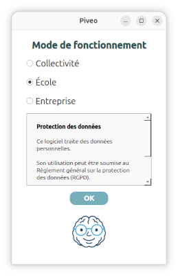
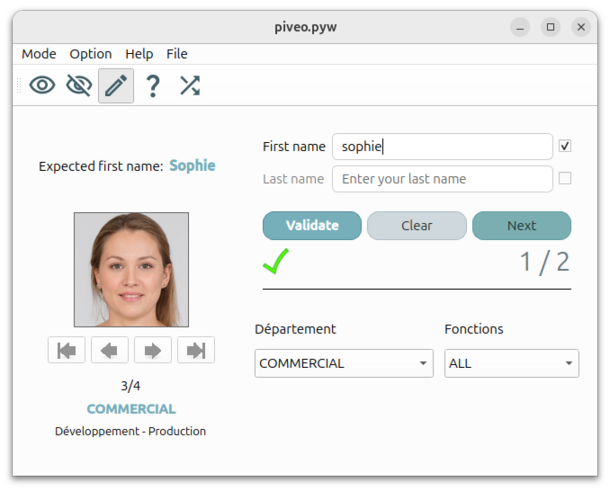
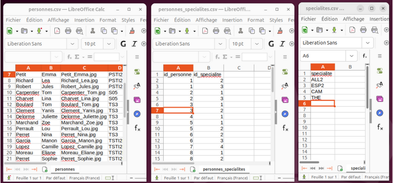

🇬🇧 [Read the English version](README.md)

Dépôt GitHub : https://github.com/GerardLeRest/Piveo-v2

# Piveo

## Objectif du projet

Piveo est une application libre, gratuite et open-source permettant d’apprendre et de mémoriser les prénoms, noms et visages pour les écoles, les entreprises et les collectivités. Elle constitue une alternative au trombinoscope. 
Les cas d’usage typiques incluent les enseignants qui apprennent les noms de leurs élèves, les équipes qui accueillent de nouveaux employés, ou les organisations qui gèrent de grands groupes de personnes.

Elle permet aux utilisateurs d’apprendre ou de retrouver les prénoms et noms des personnes à partir d’une base de données SQLite3. La configuration de cette base de données se fait à l'aide de trois fichiers CSV.

Langues : français, anglais, espagnol, breton

Piveo v2 est la version actuelle du logiciel (v2.5.3).

<p align="center">

</p>

## Fonctionnement

L’interface est divisée en trois zones :

- **Panneau gauche** : affiche les informations sur la personne
- **Panneau en haut à droite** : permet à l’utilisateur de saisir ses réponses
- **Panneau en bas à droite** : contient les paramètres

<p align="center">

</p>

### Modes disponibles

1. **Parcourir**
   - Permet de naviguer entre les personnes
   - Navigation via les boutons sous l’image
   - Mode aléatoire disponible
2. **Deviner**
   - Incite à réfléchir au nom avant affichage
   - Mode aléatoire disponible
3. **Écrit**
   - Permet de saisir le prénom et le nom dans le panneau en haut à droite
   - Mode aléatoire disponible
4. **Recherche**
   - Permet de retrouver une ou plusieurs personnes

Le programme utilise :

- Python 3
- PySide6
- Fichiers CSV d’initialisation
- Base de données SQLite3
- Configuration par fichiers CSV

<p align="center">

</p>

Trois environnements par défaut sont fournis :

- Collectivité
- École
- Entreprise

L’environnement est sélectionné au lancement de l’application.

## Vidéo

[Vidéo de présentation de Piveo](https://youtu.be/upmGYy93n2w)

## Installation

### 🔗 Depuis les sources

```bash
git clone https://github.com/GerardLeRest/Piveo
cd piveo-v2
```

```bash
python3 -m venv mon_env
source mon_env/bin/activate
```

```bash
pip install pyside6
```

### 🪟 Windows

- Aller sur : https://github.com/GerardLeRest/Piveo-v2/releases/\
- Télécharger "Piveo_Setup-X.X.X.exe"
- Installer et lancer le logiciel

### 🐧 GNU/Linux

#### 1. Télécharger l’AppImage

https://github.com/GerardLeRest/Piveo-v2/releases

#### 2. Télécharger la dernière version

Exemple :
Piveo-X.X.X-x86_64.AppImage (X.X.X : version)

#### 3. Rendre exécutable

```bash
chmod +x ~/Piveo-X.X.X-x86_64.AppImage
```

#### 4. Lancer l’application

```bash
./Piveo-X.X.X-x86_64.AppImage
```

#### 5. Répertoire des données

Répertoire où sont stockées les données utilisateur :
Linux   : ~/.local/piveo
Windows : C:\Users\username\.local\piveo

<p align="center">

</p>

## (Optionnel) Intégration au menu

```bash
sudo apt install alacarte
```

## Liens

- Téléchargements (Piveo v2) : https://github.com/GerardLeRest/piveo-v2/releases
- Dépôt officiel (Piveo v2) : https://github.com/GerardLeRest/Piveo-v2
- Documentation : https://doc.ubuntu-fr.org/Piveo
- Forum Ubuntu-fr : https://forum.ubuntu-fr.org/viewtopic.php?id=2091784
- Article LinuxFr : https://linuxfr.org/users/clisam/journaux/piveo-2-4-0-logiciel-d-apprentissage-de-prenoms-et-noms
- Site web (Piveo) : https://gerardlerest.github.io/piveo

## Protection des données

Ce logiciel fonctionne entièrement en local : aucune donnée n’est transmise ni stockée à distance.

L’utilisateur (ou l’organisation utilisant le logiciel) est responsable de l’utilisation des données importées. Lors de l’utilisation de données personnelles (noms, photos, etc.), il doit veiller au respect des réglementations applicables (notamment le RGPD).

## Licence & Images

Ce projet est distribué sous licence GPL-v3.\
© 2026 Gérard Le Rest

Les portraits ont été générés à l’aide de l’intelligence artificielle et sont utilisés à des fins éducatives non commerciales (https://generated.photos/).

Icônes : https://fonts.google.com/icons

## Mots-clés

trombinoscope, apprendre les noms, mémoriser les visages, logiciel éducatif et professionnel, intégration de nouveaux membres
