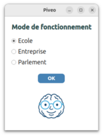
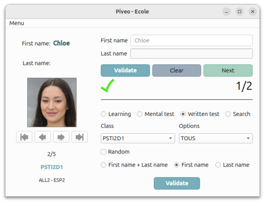

# Piveo

Documentation en français: [Documentation Piveo](README-fr.md)

## Project Purpose

Piveo is an educational application developed in Python with a PySide6 graphical interface for schools, businesses, and parliamentary institutions.
It allows users to learn or recall people’s first and last names from a SQLite3 database.

Languages: French, English, Spanish, Breton

<p align="center">
  
</p>

## How It Works

The interface has three areas:  

- **Left area**: displays information about the person.  
- **Top‑right area**: used to answer questions.  
- **Bottom‑right area**: used to configure settings (don’t forget the **Validate** button!).  

<p align="center">
  
</p>

From bottom to top, in the bottom‑right area:  

1. Selection of what to display:  
   - first name and last name  
   - first name only  
   - last name only  
2. Optional activation of **random mode** (shuffled order).  
3. Choice of ***Structure** (e.g., class) then **Specialty** (e.g., option) via the two drop‑down lists (*comboboxes*).  
4. Choice of **usage mode**:  
   - **Learning**: displays people and their information.  
   - **Mental test**: when a photo appears, the user guesses mentally before seeing the answer.
   - **Written test**: the user must type the names and/or first names using the two fields at the top right.  
   - **Search**: find one or more people by first or last name.  
5. The four buttons below the image allow browsing through the selected people.  
6. The input area (top right) is used for written tests and searches.

The folder **~/.local/piveo** contains photos, databases, and configuration files ("json").

Three organizations are provided by default (School, Parliament, Company), but you can add a custom organization (e.g., sports club) by creating your own database, images, and CSV files.  
The organization is selected at startup via **Piveo.pyw**.

## Video

[Piveo presentation video](https://youtu.be/upmGYy93n2w)

## Installation

### 🔗 From source

1. **Clone the repository**  
   
   ```bash
   git clone https://github.com/GerardLeRest/Piveo
   cd Fenetre
   ```

2. **Create a virtual environment**  
   `venv` must be installed. Here, *mon_env* is the chosen name for the Python environment.  
   
   ```bash
   python3 -m venv mon_env
   source mon_env/bin/activate
   ```

3. **Install the dependency**  
   Piveo uses the **PySide6** library for the graphical interface:  
   
   ```bash
   pip install pyside6
   ```

### 🪟 Windows

- Go to https://github.com/GerardLeRest/Piveo/releases/
- Select and download "PiveoSetup-1.1.1.exe"  
- Follow the instructions to install it on your Windows system.
- Launch the software from the Programs menu or from the Desktop

### 🐧 GNU/Linux

#### 1. Create a working folder

```bash
mkdir -p ~/Piveo
```

---

#### 2. Go to the Downloads folder

```bash
cd ~/Downloads
```

---

#### 3. Download the AppImage archive

Go to the GitHub releases page:  
https://github.com/GerardLeRest/Piveo/releases

Download the **latest AppImage archive**, for example:

Piveo-x.x.x-_x86_64.AppImage (replace x.x.x with 2.2.1 for version 2.2.1, for example)

#### 4. Extract the archive

```bash
tar -xf Piveo-x.x.x-_x86_64.AppImage.tar.xz
```

---

#### 5. Copy the files into the Piveo folder

```bash
cp -r ~/Downloads/Piveo-x.x.x-_x86_64.AppImage/. ~/Piveo
```

You can also use the folder /opt/piveo instead of ~/Piveo, which is also intended for this type of installation.

---

#### 6. Make the AppImage executable

```bash
chmod +x ~/Piveo/Piveo-x.x.x-_x86_64.AppImage
```

---

#### 7. Launch the software

Go to the ~/Piveo folder:

```bash
cd ~/Piveo
```

Launch Piveo:

```bash
./Piveo-x.x.x-_x86_64.AppImage
```

or double‑click the icon

---

<p align="center">
  
</p>

## (Optional) System menu integration

You can install **Alacarte**, which makes it easy to add Piveo to the applications menu:

```bash
sudo apt install alacarte
```

## Notes

- Compatible with Python 3.8+  
- Tested on Ubuntu and Windows  
- The application is under continuous improvement (v1.0.0)

## Links

- [Website](https://gerardlerest.github.io/piveo/)  
- [GitHub repository](https://github.com/GerardLeRest/Piveo)
- [Wiki page](https://doc.ubuntu-fr.org/Piveo)

## License & photos

This project is distributed under the **GPL‑v3** license.  
© 2026 Gérard LE REST  

The portraits were generated by artificial intelligence and are used in a non‑commercial educational context.  
*"Image by Generated Photos (https://generated.photos), used with permission."*
