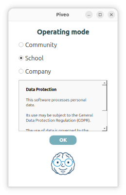

<p align="center">
  <a href="README_FR.md">🇫🇷 Français</a> | English
</p>

# Piveo – Free and open-source software for learning and memorizing names and faces

## Project goal

Piveo is a **free and open-source application** that helps users learn names, first names, and faces. It can be considered an alternative to the traditional photo directory.

Typical use cases include teachers learning students’ names, teams welcoming new employees, or organizations managing large groups of people.

Each environment relies on an SQL database. Piveo simplifies administration through three CSV configuration files located in the working directory (see below).

**Available languages**: French, English, Spanish, Breton

****Operating systems:** GNU/Linux (tested on Ubuntu 24.04), Windows

Piveo v2 is the current version of the software (v2.5.3).

<p align="center">

</p>

## How it works

The interface is divided into three sections:

- **Left panel**: displays information about the person
- **Top-right panel**: allows the user to enter answers
- **Bottom-right panel**: contains the settings

<p align="center">

</p>

### Available modes

1. **Browse**
   
   - Navigate through people
   - Navigation buttons below the image
   - Random mode available

2. **Guess**
   
   - Encourages the user to think of the name before displaying it
   - Random mode available

3. **Written**
   
   - Allows the user to type the first name and last name in the top-right panel
   - Random mode available

4. **Search**
   
   - Allows users to search for one or several people

The application is based on the following technologies:

- Python 3
- PySide6
- SQLite3
- Initialization and configuration through CSV files

<p align="center">

</p>

Three default environments are provided:

- **Community**
- **School**
- **Company**

The environment is selected when launching the application.

## Video

Presentation video of Piveo:

https://youtu.be/upmGYy93n2w

## Installation

### 🔗 From source

```bash
git clone https://github.com/GerardLeRest/Piveo-v2
cd piveo-v2
```

```bash
python3 -m venv my_env
source my_env/bin/activate
```

```bash
pip install pyside6
```

### 🪟 Windows

- Go to:
  https://github.com/GerardLeRest/Piveo-v2/releases
- Download:
  `Piveo_Setup-X.X.X.exe`
- Install and launch the software

### 🐧 GNU/Linux

#### 1. Download the AppImage

https://github.com/GerardLeRest/Piveo-v2/releases

#### 2. Download the latest version

Example:

`Piveo-X.X.X-x86_64.AppImage`
(X.X.X = version number)

#### 3. Make it executable

```bash
chmod +x ~/Piveo-X.X.X-x86_64.AppImage
```

#### 4. Launch the application

```bash
./Piveo-X.X.X-x86_64.AppImage
```

Ubuntu-fr documentation:

https://doc.ubuntu-fr.org/appimage

#### 5. Data directory

Directory where user data is stored:

- GNU/Linux: `~/.local/piveo`
- Windows: `C:\Users\username\.local\piveo`

<p align="center">

</p>

## (Optional) Menu integration

```bash
sudo apt install alacarte
```

## Links

- Downloads (Piveo v2):
  https://github.com/GerardLeRest/piveo-v2/releases
- Documentation:
  https://doc.ubuntu-fr.org/Piveo
- Ubuntu-fr forum:
  https://forum.ubuntu-fr.org/viewtopic.php?id=2091784
- LinuxFr article:
  https://linuxfr.org/users/clisam/journaux/piveo-2-4-0-logiciel-d-apprentissage-de-prenoms-et-noms
- Website:
  https://gerardlerest.github.io/piveo

## Data protection

This software works entirely offline: no data is transmitted or stored remotely.

The user (or the organization using the software) is responsible for the use of imported data. When using personal data (names, photos, etc.), users must ensure compliance with applicable regulations, especially GDPR.

## License & Images

This project is distributed under the GPL-v3 license.  
© 2026 Gérard Le Rest

The portraits were generated using artificial intelligence and are used for non-commercial educational purposes:

https://generated.photos/

Icons:

https://fonts.google.com/icons
